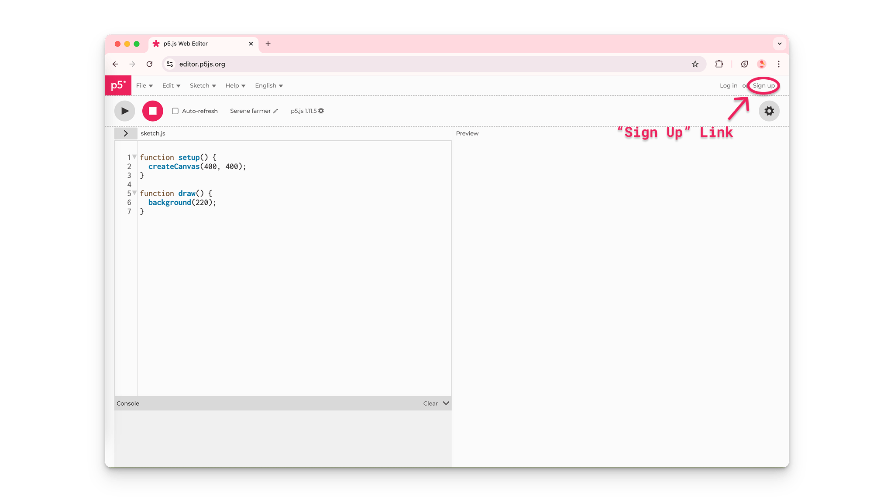
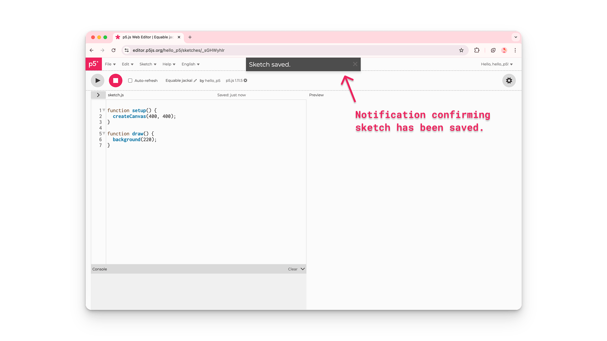

I denne guiden skal vi bruke ["p5.js Web Editor"](https://editor.p5js.org/) til å skrive, lagre og kjøre programmer.

p5.js Web Editor er et nettsted der programmerere kan skrive, teste, kjøre eller eksperimentere p5.js‑programmer uten å måtte laste ned eller sette opp en kodeeditor på datamaskinen. En kodeeditor gjør det enklere å skrive og lese kode ved å strukturere og fargelegge teksten på en måte som hjelper programmerere å se de ulike delene av koden.

## Hva du trenger

1. Tilgang til internett og en moderne nettleser, for eksempel Chrome, Firefox, Safari eller Edge.
2. En stasjonær datamaskin, bærbar datamaskin eller Chromebook.

## Steg 1: Åpne registreringssiden

Åpne en nettleser på datamaskinen og gå til <a href="https://editor.p5js.org/" target="_blank" rel="noreferrer">`https://editor.p5js.org/`</a>.
Klikk på "Sign up"-lenken øverst til høyre på nettsiden.



## Steg 2: Lage konto

Har du allerede registrert deg så kan du logge inn ved å klikke på "Login"-lenken øverst til høyre på nettsiden og følge instruksjonene for å logge inn med e‑post, Google‑konto eller GitHub‑konto. Da kan du hoppe videre til Steg 3.

Når du er på registreringssiden, lager du en konto i p5.js Web Editor på en av disse måtene:

1. Velg «Sign up» med e‑post (manuell registrering). Anbefales for de som ikke har en Google‑ eller GitHub‑konto.
    1. Skriv inn et brukernavn.
    2. Skriv inn e‑postadressen din.
    3. Lag et passord og skriv det inn på nytt for å bekrefte.
    4. Klikk på «Sign Up»-knappen.

2. Ved å bruke en Google‑konto
    - Klikk på knappen nederst på siden som heter «Login with Google».

    - Følg instruksjonene for å skrive inn e‑postadressen og passordet til Google‑kontoen din (om nødvendig).
3. Ved å bruke en GitHub‑konto
    - Klikk på knappen nederst på siden som heter «Login with GitHub».

    - Følg instruksjonene for å skrive inn brukernavn og passord for GitHub‑kontoen din.
    - Gi p5.js Web Editor tilgang til GitHub‑kontoen din ved å klikke på «Authorize processing»-knappen.


## Steg 3: Utforsk web‑editoren

p5.js Web Editor er et nettbasert miljø der programmerere kan skrive og teste p5.js‑kode. Nå skal vi utforsk de ulike delene av p5.js Web Editor og hva de brukes til.

Diagrammet under viser og beskriver hver del av brukergrensesnittet i editoren:


## Steg 4: Gi navn til, lagre og kjør ditt første program

- Gi navn til prosjektene dine ved å klikke på blyantikonet over teksteditoren og skrive inn et navn for prosjektet.

- Lagre prosjekter ved å klikke på «File» i verktøylinjen øverst og velge «Save».
    - Pass på at du er logget inn på kontoen din, ellers kan du ikke lagre prosjektet.
    - Det er lurt å lagre prosjektene ofte, slik at koden ikke går tapt hvis noe skjer med datamaskinen, nettleseren eller internettforbindelsen mens du koder.


For å se resultatet av koden din, klikker du på Play‑knappen øverst til venstre:

P5.js‑programmer er tekstfiler med kode skrevet i programmeringsspråket JavaScript. JavaScript er et språk som brukes til å gjøre nettsider interaktive. p5.js er et bibliotek skrevet i JavaScript – derfor slutter navnet på «.js» for JavaScript. Med p5.js kan du lage programmer som er fargerike og animerte, med ting brukerne kan trykke på og leke seg med!

Editor‑fanen starter med denne koden i sketch.js‑filen:
```javascript
function setup() {
  createCanvas(400, 400);
}
function draw() {
  background(220);
}
```
Koden over lager et canvas‑element i forhåndsvisningen som er 400 piksler bredt og 400 piksler høyt. Den setter også bakgrunnen til en gråfarge. Canvas er det området i forhåndsvisningen der du kan tegne og animere ting. Det er som et digitalt lerret for programmering!

### createCanvas()

Dataskjermer er bygd opp av bittesmå lys som kalles piksler. Det er de minste byggesteinene i alle bilder. Linjen med kode som lager et tegneområde i forhåndsvisningen er createCanvas(400, 400). Uten denne linjen har du ikke noe å tegne på! Tallene 400, 400 sier hvor bredt og hvor høyt canvaset skal være, målt i piksler. Disse tallene kalles argumenter til createCanvas()-funksjonen.

Verdiene du skriver inni parentesene til en funksjon, kalles argumenter – altså verdier du bruker for å tilpasse hvordan funksjonen oppfører seg. createCanvas() står inne i setup()-funksjonen for å lage et HTML‑canvas‑element som du kan tegne på.

## Steg 5: Endre fargen på canvaset
- Du kan skrive kommandoer for hvilken som helst skisse i teksteditoren, og se resultatet i forhåndsvisningen ved å klikke på Play.
- Endre bakgrunnsfargen på canvaset ved å endre argumentet til background()-funksjonen.
    - Bytt background(220); til background("aqua"); og trykk på Play.

```javascript
function setup() {
  createCanvas(400, 400);
}
function draw() {
  background("aqua");
}
```
### background()
background()-funksjonen farger bakgrunnen i en bestemt farge. Du kan bruke ord inni anførselstegn eller tallverdier for å sette fargen på bakgrunnen til canvaset.

## Steg 6: Tegn figurer på canvaset

- Tegn en sirkel på canvaset.
    - Legg til denne kodelinjen under background()-funksjonen:
    ```javascript
    //circle in the center with a width of 100
    circle(200,200,100);
    ```
- Trykk på Play for å se resultatet.

Din kode skal nå se slik ut:
```javascript
function setup() {
  createCanvas(400, 400);
}
function draw() {
  background(220);

  // Draw a circle in the center with
  // a width of 100.
  circle(200, 200, 100);
}
```
### draw()

Du kan tegne figurer på canvaset ved å skrive bestemte kommandoer for figurer inne i klammeparentesene {} etter function draw().

Skissen over tegner en sirkel på canvaset ved å kalle circle()-funksjonen inne i draw(). De to første argumentene – 200, 200 – plasserer sirkelen midt på canvaset, og det siste argumentet – 100 – sier at sirkelen er 100 piksler bred. Kommentarene som er skrevet inn i skissen i linjene over circle()-funksjonen forklarer hva koden gjør.

## Steg 7: Eksperimenter!

p5.js har mange funksjoner du kan bruke for å lage både statiske og interaktive elementer på canvaset.

Bytt ut background- og circle‑kommandoene med denne koden:
```javascript
//when mouse button is pressed, circles turn black
if (mouseIsPressed === true) {
  fill(0);
} else {
  fill(255);
}

//white circles drawn at mouse position
circle(mouseX, mouseY, 100);
```

Koden din skal nå se slik ut:
```javascript
function setup() {
  createCanvas(400, 400);
}
function draw() {
  //when mouse button is pressed, circles turn black
  if (mouseIsPressed === true) {
    fill(0);
  } else {
    fill(255);
  }

  //white circles drawn at mouse position
  circle(mouseX, mouseY, 100);
}
```

***Prøv dette!***
Hold nede museknappen mens du drar musepekeren over canvaset.

Koden over tegner hvite sirkler på samme sted som musepekeren. Når museknappen holdes inne, endrer sirkelen farge til svart.